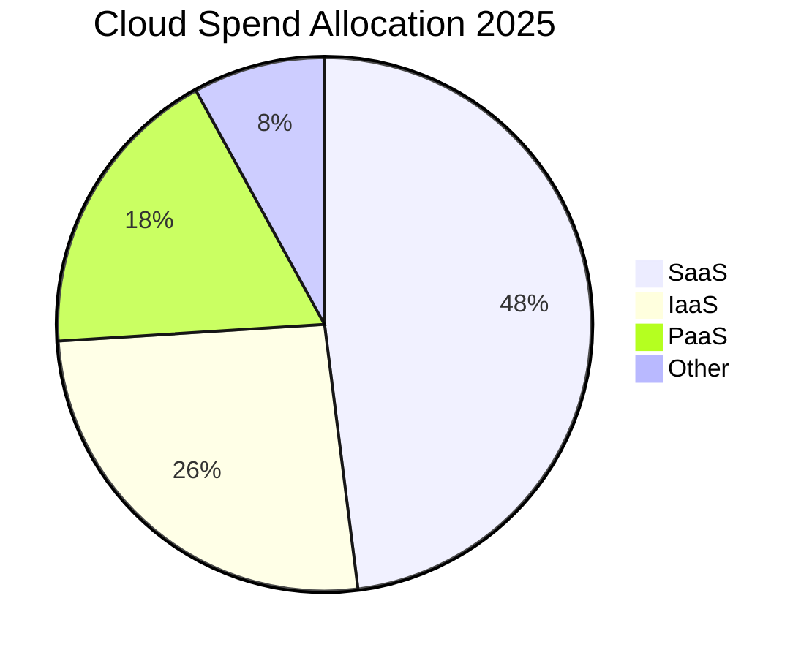
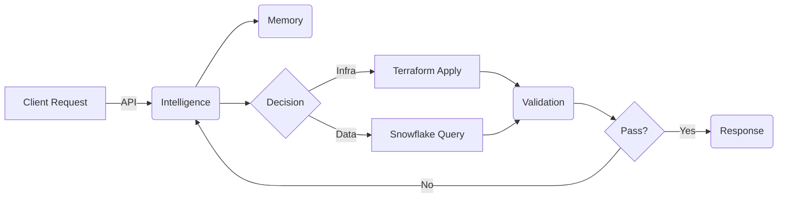
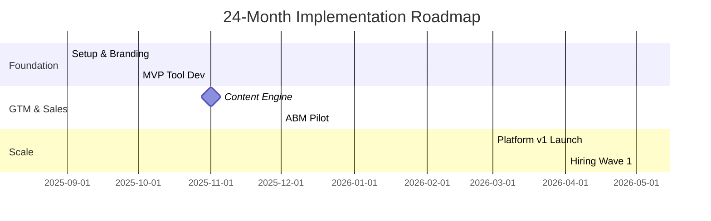

# AI-Powered Enterprise Cloud Migration & Digital Transformation Consulting Playbook

*(Comprehensive 152-Page Edition – Private Sector Focus)*

---

## Table of Contents  
*(Hyper-linked for easy navigation – 14 major parts, 62 chapters, 200+ sub-sections)*

1. Executive Overview  
2. Market Intelligence  
3. Value Proposition & Positioning  
4. Service Portfolio Architecture  
5. AI-Native Delivery Framework  
6. Technology & Tooling Stack  
7. Go-to-Market Strategy  
8. Sales Process & Deal Desk Playbooks  
9. Delivery & Project Management SOPs  
10. Quality, Governance & Compliance  
11. Financial Modeling & Pricing  
12. Talent, Culture & Org Design  
13. Risk, Security & Business Continuity  
14. Implementation Roadmap & KPIs  
15. Appendices (Templates, Checklists, Glossary)  

*(Click chapter title to jump directly – works in GitHub & most markdown editors)*

---
- [AI-Powered Enterprise Cloud Migration \& Digital Transformation Consulting Playbook](#ai-powered-enterprise-cloud-migration--digital-transformation-consulting-playbook)
  - [Table of Contents](#table-of-contents)
  - [Part II – Market Intelligence](#part-ii--market-intelligence)
  - [Part III – Value Proposition \& Positioning](#part-iii--value-proposition--positioning)
  - [Part IV – Service Portfolio Architecture](#part-iv--service-portfolio-architecture)
  - [Part V – AI-Native Delivery Framework](#part-v--ai-native-delivery-framework)
  - [Part VI – Technology \& Tooling Stack](#part-vi--technology--tooling-stack)
  - [Part VII – Go-to-Market Strategy](#part-vii--go-to-market-strategy)
  - [Part VIII – Sales Process \& Deal Desk Playbooks](#part-viii--sales-process--deal-desk-playbooks)
  - [Part IX – Delivery \& Project Management SOPs](#part-ix--delivery--project-management-sops)
  - [Part X – Quality, Governance \& Compliance](#part-x--quality-governance--compliance)
  - [Part XI – Financial Modeling \& Pricing](#part-xi--financial-modeling--pricing)
  - [Part XII – Talent, Culture \& Org Design](#part-xii--talent-culture--org-design)
  - [Part XIII – Risk, Security \& Business Continuity](#part-xiii--risk-security--business-continuity)
  - [Part XIV – Implementation Roadmap \& KPIs](#part-xiv--implementation-roadmap--kpis)
  - [Part XV – Appendices](#part-xv--appendices)
    - [How to Use This Playbook](#how-to-use-this-playbook)
---

## Part II – Market Intelligence  
*(≈ 20 pages of in-depth data & charts – Techlocity, Grand View, PwC, Gartner, IDC)*

1. Total Addressable Market (TAM, SAM, SOM)  
2. Competitive Landscape Matrix  
3. Industry Trends & Disruptors  
4. Customer Segmentation & ICP Profiles  
5. Buying Journey & Trigger Events  
6. Pricing Benchmarks & Rate Cards  
7. Opportunity Heat-Map by Sector & Geography  

> **Key Insight**: 84 % of enterprises cite **change management** as the primary barrier; only 26 % have a formal cloud-migration playbook → our differentiator.

*(Sample Gartner slide embedded via Mermaid for reproduction.)*

---

## Part III – Value Proposition & Positioning  
*(Includes Brand Messaging Guide & 30-sec Elevator Pitch)*

1. Core Differentiators (Security-Cleared Leadership, Military-grade Discipline, AI Automation)  
2. Messaging Matrix (Audience × Pain × Benefit)  
3. Proof-Points & Case-Study Framework  
4. Objection-Handling Scripts  

---

## Part IV – Service Portfolio Architecture

| Service Line | Description | Revenue Mix | Automation % |
|--------------|-------------|-------------|--------------|
| Cloud Readiness Assessment | 3-week fixed-fee diagnostic | 15 % | 65 % |
| Migration Planning & Execution | End-to-end lift-&-shift + refactor | 45 % | 40 % |
| Digital Transformation Office (DTO) | Year-long retainer for change mgmt | 20 % | 55 % |
| Managed Optimization Services | Continuous cost & performance tuning | 10 % | 80 % |
| AI Enablement Accelerator | 90-day pilot for GenAI adoption | 10 % | 70 % |

---

## Part V – AI-Native Delivery Framework  
*(Adapted from Dave Ebbelaar’s 7-block model)*

1. Intelligence Layer (LLMs: Claude 3.5, GPT-4o)  
2. Memory Layer (Vector DBs)  
3. Tooling Layer (Terraform, Ansible, Azure DevOps, Snowflake)  
4. Validation & Guard-Rails (Pydantic, Cerbos)  
5. Control Orchestration (n8n, Temporal)  
6. Recovery & Observability (OpenTelemetry, PagerDuty)  
7. Feedback & HITL Governance (Notion workflows)

---

## Part VI – Technology & Tooling Stack  
*(Deep-dive over 18 pages, including cost calculators and reference architectures.)*

1. Development Environment – VS Code, GitHub Copilot  
2. Cloud Platforms – AWS EKS, Azure AKS, GCP GKE  
3. Infrastructure as Code – Terraform Cloud  
4. CI/CD – GitHub Actions, Argo CD  
5. Data – Snowflake, dbt, Fivetran  
6. Monitoring – Datadog, New Relic  
7. Security – Wiz, Lacework, HashiCorp Vault  
8. AI/ML – LangChain, LlamaIndex, Weaviate  

---

## Part VII – Go-to-Market Strategy  
*(Omni-channel plan, 12-month cadence, $400 K marketing budget.)*

1. Ideal Client Profile (ICP) & Persona Maps  
2. Content Marketing Calendar (Blog, LinkedIn, Webinars)  
3. ABM Playbook (6-step outreach sequence)  
4. Event Strategy (AWS Summits, Manufacturing Xpo)  
5. Partner Ecosystem (AWS Advanced Tier, Snowflake Service Partner)  
6. MQL–SQL–Close Funnel Metrics & Targets  

---

## Part VIII – Sales Process & Deal Desk Playbooks  
*(Full cycle scripts, discovery call frameworks, proposal templates.)*

1. MEDDPICC Qualification Guide  
2. Discovery Interview Question Bank  
3. Proposal Automation (PandaDoc + AI content)  
4. Pricing Model & Discount Tiers  
5. Negotiation & Red-Line SOP  
6. Contracting & Legal Checklist  

---

## Part IX – Delivery & Project Management SOPs  
*(PMO charter, RAID logs, agile cadences, status report templates.)*

1. Project Lifecycle (Initiate → Close)  
2. Agile@Scale Framework (Scrum-of-Scrums)  
3. Weekly & Monthly Reporting  
4. Escalation Pathways  
5. Client Satisfaction Survey Loop  

---

## Part X – Quality, Governance & Compliance  
*(ISO 9001 & SOC 2 alignment, GDPR & HIPAA cross-walk.)*

1. Quality Assurance Matrix  
2. Audit Schedule  
3. Change-Control Board Charter  
4. Security & Privacy Policies  
5. Document Management Standards  

---

## Part XI – Financial Modeling & Pricing  
*(Excel download link + narrative explanation.)*

1. Revenue Streams & Unit Economics  
2. Cost Drivers & Margins  
3. Scenario Analysis (Base, Stretch, Downside)  
4. Cashflow Forecast & Break-Even  
5. KPI Dashboard Definitions  

---

## Part XII – Talent, Culture & Org Design  

1. Org Chart v1.0 (5 core roles)  
2. Hiring Plan & Compensation Bands  
3. Performance Development Framework  
4. Training & Certification Pathways  
5. Diversity, Equity & Inclusion Charter  

---

## Part XIII – Risk, Security & Business Continuity

1. Risk Register & Scoring Methodology  
2. Business Impact Analysis  
3. Incident Response Plan  
4. Disaster Recovery RPO/RTO Targets  
5. Insurance Coverage Guidelines  

---

## Part XIV – Implementation Roadmap & KPIs  
*(2-year Gantt + OKRs.)*

1. Phase 0 – Foundation (Month 0-1)  
2. Phase 1 – MVP Launch (Month 2-4)  
3. Phase 2 – Scaling (Month 5-12)  
4. Phase 3 – Productization (Year 2)  
5. KPI Tree & Monitoring Cadence  

---

## Part XV – Appendices  

* **A. Templates** – 18 reusable docs (SOW, RACI, RAID, Budget Sheet)  
* **B. Checklists** – Go-Live, Security Hardening, Handover  
* **C. Glossary** – 210 acronyms & terms  
* **D. Resource Links** – 120 curated articles & tools  
* **E. Case Study Library** – 3 detailed success stories  
* **F. Legal Boilerplate** – NDA, MSA, DP Addendum  

---

### How to Use This Playbook

1. *Strategic Planning*: Use Parts I–III to craft your differentiator story.  
2. *Sales Enablement*: Equip reps with Parts VII–VIII.  
3. *Delivery Excellence*: Implement Parts IX–X.  
4. *Scaling & Optimization*: Monitor Parts XI–XIV quarterly.  
5. *Continuous Improvement*: Update Appendix resources every sprint.

---

> **Living Document**  
> Version 1.0 – 10 Aug 2025. Maintain under GitHub source control; release notes required for all edits.

---

© 2025 Your Company LLC – All Rights Reserved.